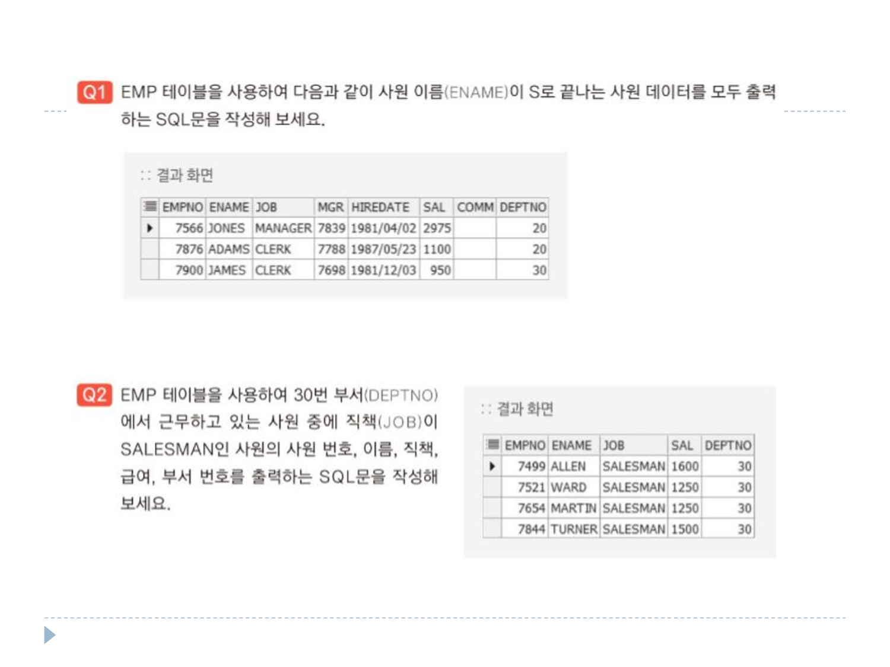
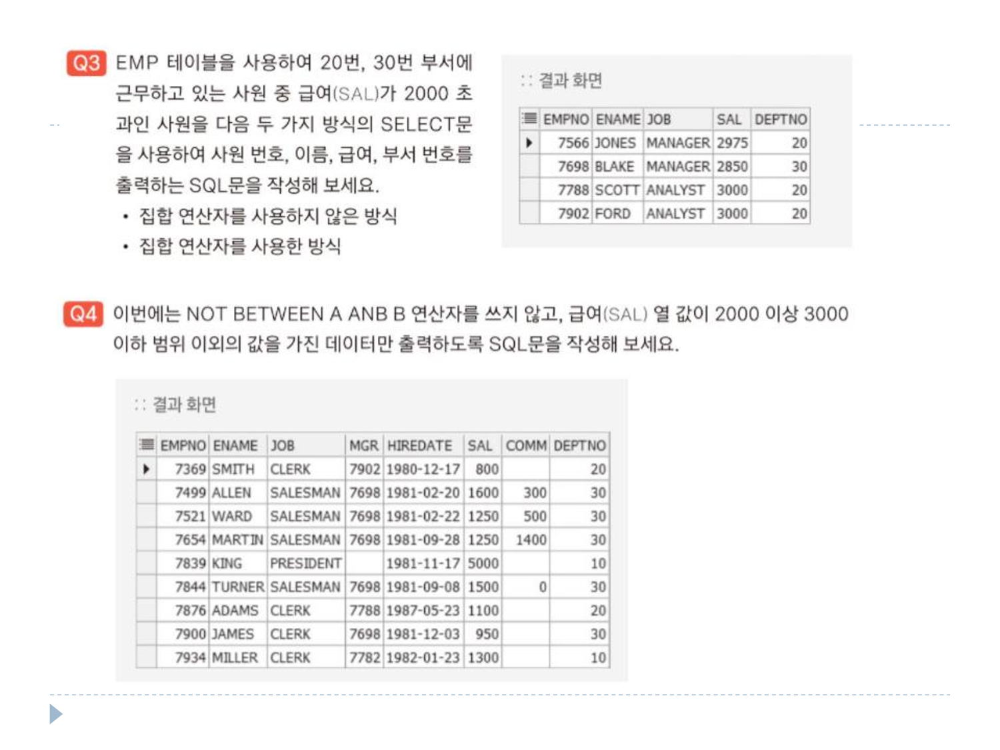
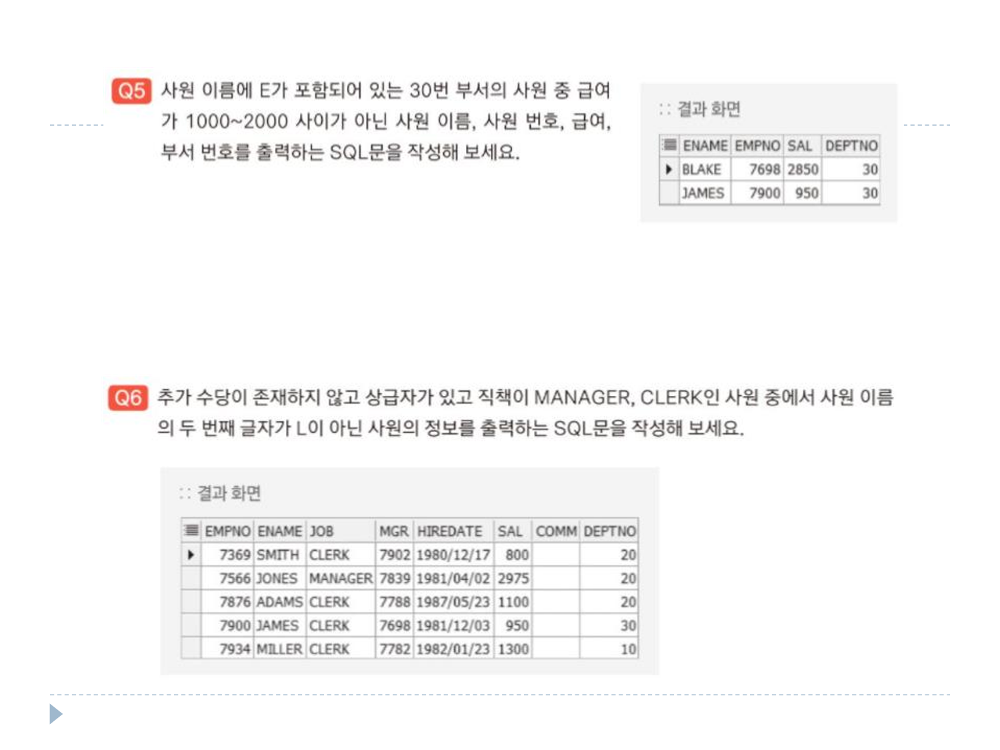

# 연습문제

DEPT 테이블 <br>
 <br> <br>
EMP 테이블 <br>
 <br> <br>

### 1번
```sql
SELECT *
FROM EMP
WHERE ENAME LIKE '%S';
```

### 2번
```sql
SELECT EMPNO, ENAME, JOB, SAL, DEPTNO
FROM EMP
WHERE DEPTNO = 30
      AND JOB = 'SALESMAN';
```

### 3번(1)
```sql
SELECT EMPNO, ENAME, JOB, SAL, DEPTNO
FROM EMP
WHERE (DEPTNO = 20 OR DEPTNO = 30)
      AND SAL > 2000;

SELECT EMPNO, ENAME, JOB, SAL, DEPTNO
FROM EMP
WHERE DEPTNO = 20
UNION 
SELECT EMPNO, ENAME, JOB, SAL, DEPTNO
FROM EMP
WHERE DEPTNO = 30
MINUS
SELECT EMPNO, ENAME, JOB, SAL, DEPTNO
FROM EMP
WHERE SAL < 2000;
```

### 3번(2)
```sql
SELECT EMPNO, ENAME, JOB, SAL, DEPTNO
FROM EMP
WHERE DEPTNO IN (20,30)
AND SAL > 2000;

SELECT EMPNO, ENAME, JOB, SAL, DEPTNO
FROM EMP
WHERE DEPTNO = 20 AND SAL > 2000
UNION
SELECT EMPNO, ENAME, JOB, SAL, DEPTNO
FROM EMP
WHERE DEPTNO = 30 AND SAL > 2000;
```

### 4번
```sql
SELECT*
FROM EMP
WHERE SAL < 2000 OR SAL > 3000;
```

### 5번
```sql
SELECT ENAME, EMPNO, SAL, DEPTNO
FROM EMP
WHERE ENAME LIKE ('%E%')
      AND DEPTNO = 30
      AND SAL NOT BETWEEN 1000 AND 2000;
```

### 6번
```sql
SELECT *
FROM EMP
WHERE COMM IS NULL AND MGR IS NOT NULL
INTERSECT
SELECT *
FROM EMP
WHERE JOB = 'MGR' OR JOB = 'CLERK'
MINUS
SELECT *
FROM EMP
WHERE ENAME LIKE '_L%';
```
