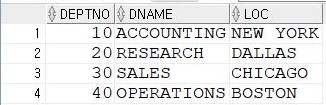
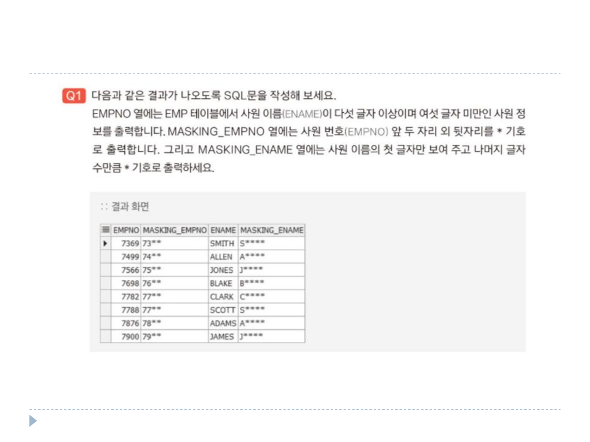
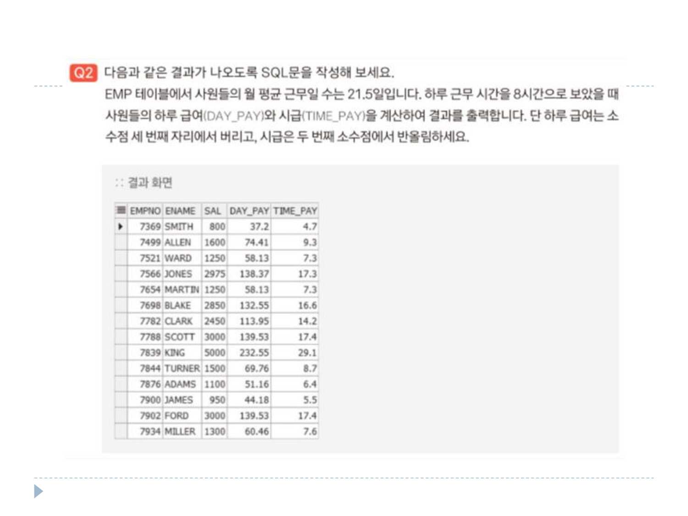
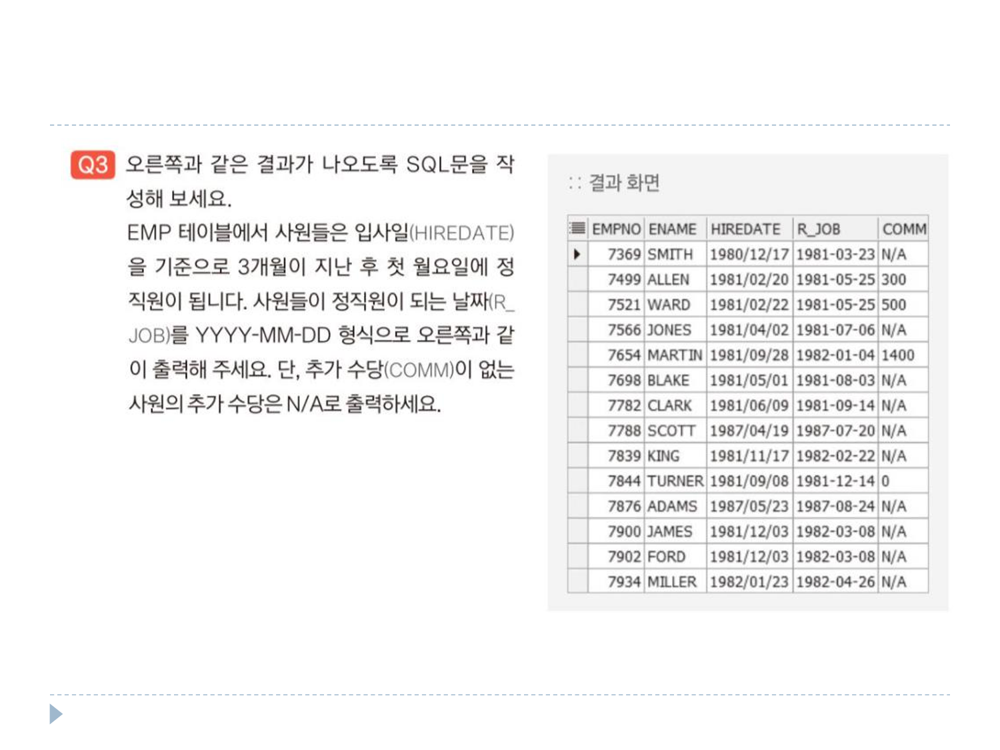
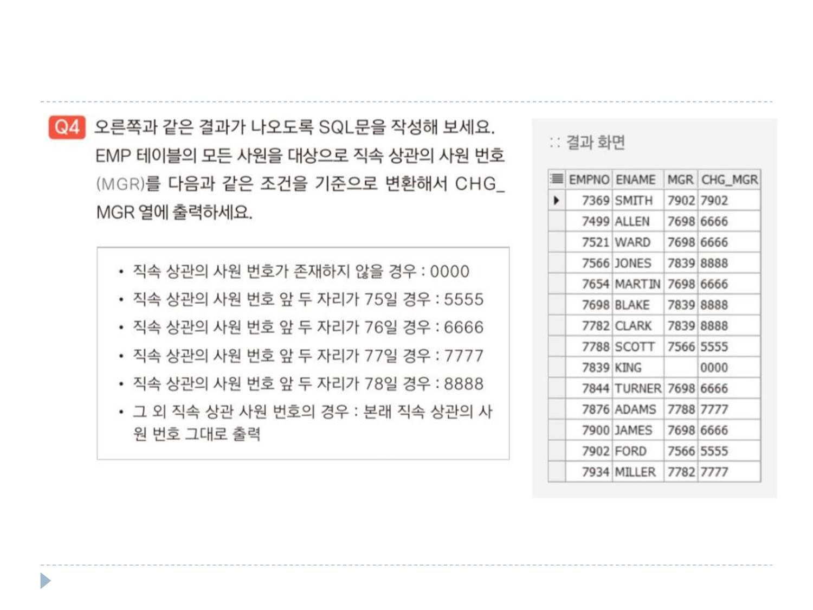

# 연습문제

DEPT 테이블 <br>
 <br> <br>
EMP 테이블 <br>
 <br>

### 1번
```sql
SELECT EMPNO, 
       RPAD(SUBSTR(EMPNO, 1, 2), 4, '*') AS MASKING_EMPNO,
       ENAME,
       RPAD(SUBSTR(ENAME, 1, 1), 5, '*') AS MASKING_ENAME
FROM EMP
WHERE LENGTH(ENAME) = 5;
```

### 2번
```sql
SELECT EMPNO,
       ENAME,
       SAL,
       TRUNC(SAL/21.5, 2) AS DAY_PAY,
       ROUND(SAL/21.5/ 8, 1) AS TIME_PAY
FROM EMP;
```

### 3번
'N/A' 출력 시 COMM 타입을 문자로 바꾸어 주어야 출력이 가능함.
```sql
SELECT EMPNO,
       ENAME,
       TO_CHAR(HIREDATE, 'YYYY/MM/DD') AS HIREDATE,
       TO_CHAR(NEXT_DAY(ADD_MONTHS(HIREDATE, 3), 2), 'YYYY-MM-DD') AS R_JOB,
       NVL(TO_CHAR(COMM), 'N/A') AS COMM
FROM EMP;
```

### 4번
```sql
SELECT EMPNO,
       ENAME,
       CASE JOB
            WHEN MGR IS NULL THEN '0000',
            WHEN MGR LIKE '75%' THEN '5555',
            WHEN MGR LIKE '76%' THEN '6666',
            WHEN MGR LIKE '76%' THEN '7777',
            WHEN MGR LIKE '78%' THEN '8888',
            ELSE MGR
        ENS AS CHG_MGR
FROM EMP;
```
