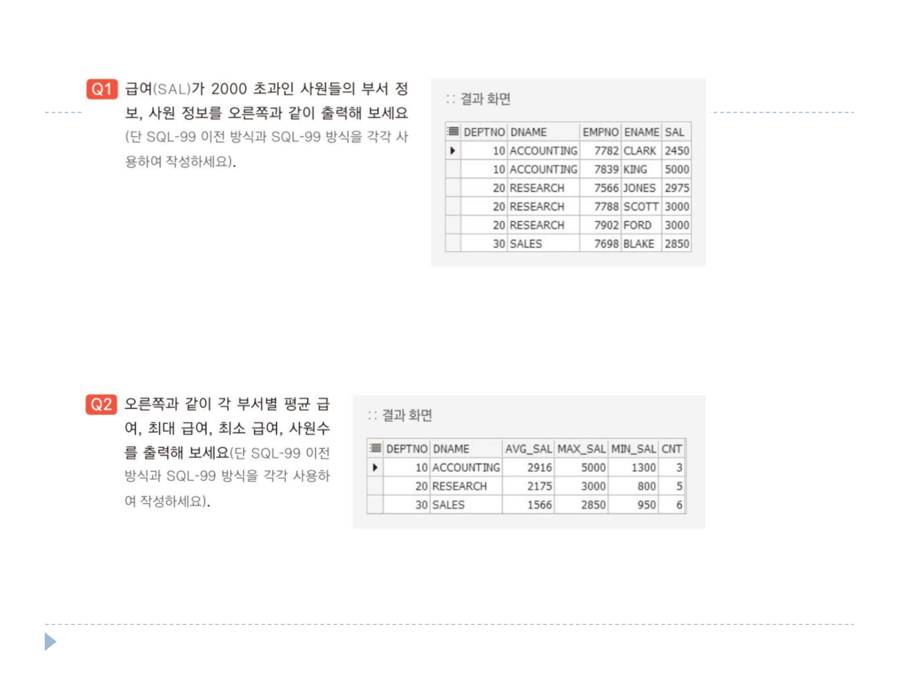
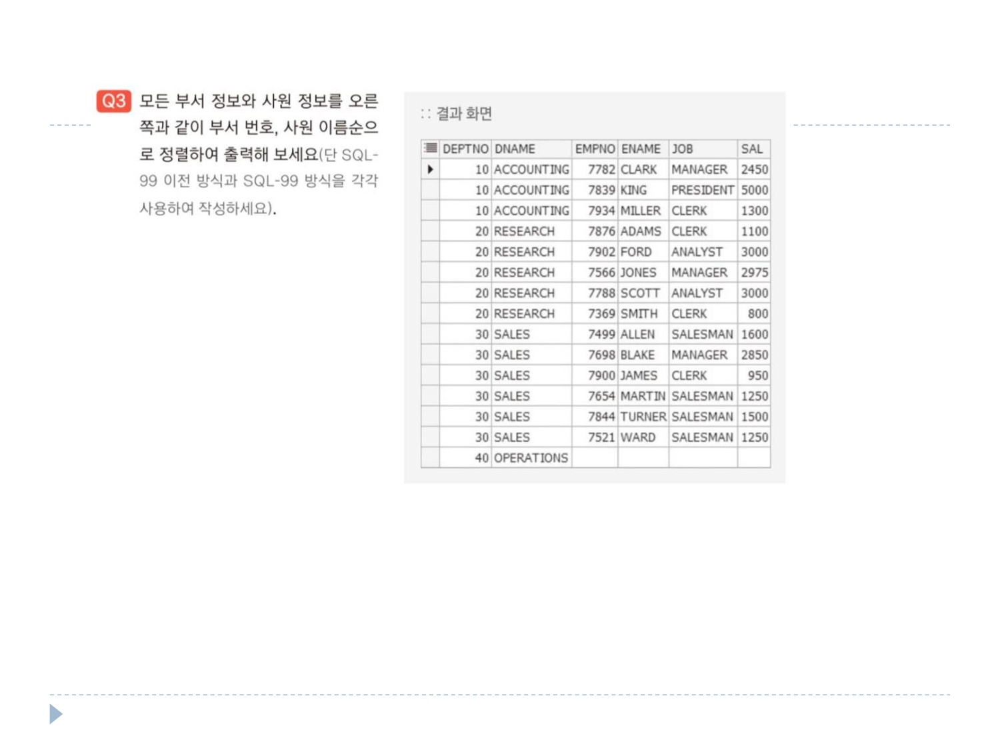
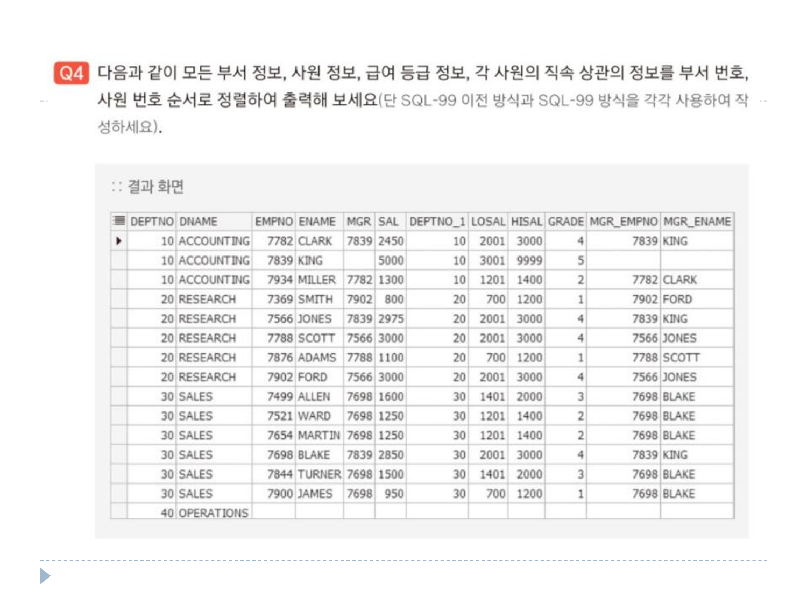

# 연습문제

DEPT 테이블 <br>
 <br> <br>
EMP 테이블 <br>
 <br> <br>

```sql
SELECT* FROM EMP;
```

### 1번
```sql
SELECT B.DEPTNO, B.DNAME, A.EMPNO, A.ENAME, A.SAL
FROM EMP A, DEPT B
WHERE B.DEPTNO = A.DEPTNO AND SAL > 2000
ORDER BY B.DEPTNO;
```

### 2번
```sql
SELECT A.DEPTNO, A.DNAME, 
       TRUNC(AVG(B.SAL), 0) AVG_SAL, 
       MAX(B.SAL) MAX_SAL, 
       MIN(B.SAL) MIN_SAL,
       COUNT(A.DNAME) CNT
FROM DEPT A INNER JOIN EMP B
ON A.DEPTNO = B.DEPTNO
GROUP BY A.DEPTNO, A.DNAME
ORDER BY A.DEPTNO;
```

### 3번
```sql
SELECT A.DEPTNO,
       A.DNAME,
       B.EMPNO,
       B.ENAME,
       B.JOB,
       B.SAL
FROM DEPT A, EMP B
WHERE A.DEPTNO = B.DEPTNO(+)
ORDER BY DEPTNO, ENAME;
```

### 4번
```sql
SELECT A.DEPTNO,
       --A.DNAME,
       A.EMPNO,
       B.ENAME,
       B.MGR,
       B.SAL,
       B.DEPTNO DEPTNO_1,
       B.EMPNO MGR_EMPNO,
       B.ENAME MGR_ENAME
FROM EMP A, EMP B
WHERE A.EMPNO = B.MGR
ORDER BY A.DEPTNO, B.EMPNO;
```
