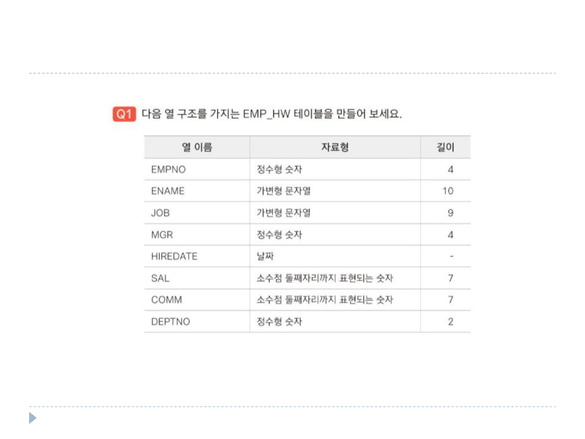
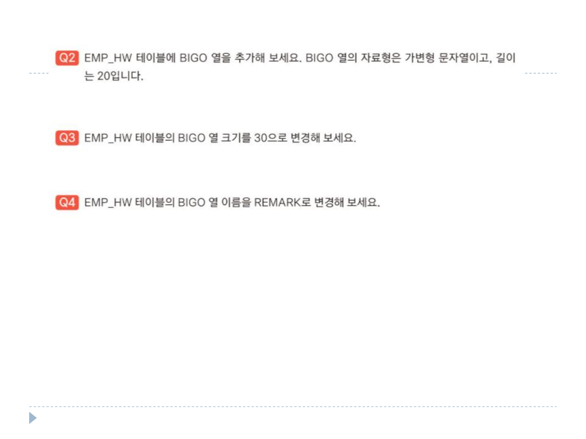
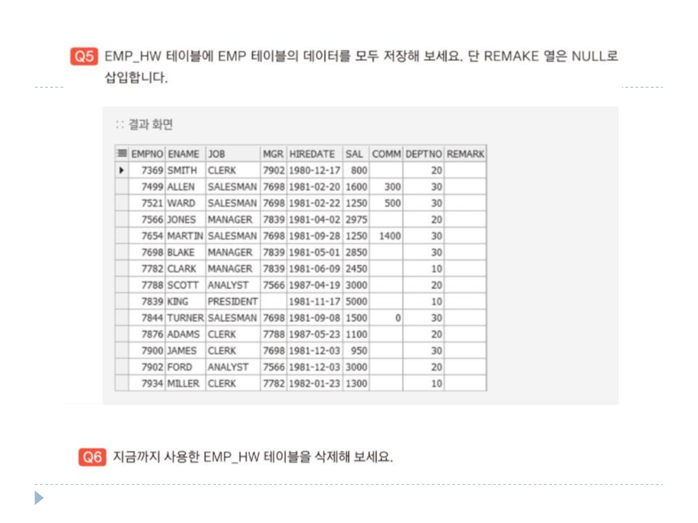

# 12장 연습문제

DEPT 테이블 <br>
 <br> <br>
EMP 테이블 <br>
 <br>

### 1번
```sql
CREATE TABLE EMP_HW(
    EMPNO NUMBER(4),
    ENAME VARCHAR2(10),
    JOB VARCHAR2(9),
    MGR NUMBER(4),
    HIREDATE DATE,
    SAL NUMBER(7,2),
    COMM NUMBER(7,2),
    DEPTNO NUMBER(2)
);

SELECT * FROM EMP_HW;
```

### 2번
```sql
ALTER TABLE EMP_HW
ADD BIGO VARCHAR2(20);

SELECT * FROM EMP_HW;
```

### 3번
```sql
ALTER TABLE EMP_HW
MODIFY BIGO VARCHAR2(30);

SELECT * FROM EMP_HW;
```

### 4번
```sql
ALTER TABLE EMP_HW
RENAME COLUMN BIGO TO REMARK;

SELECT * FROM EMP_HW;
```

### 5번
```sql
INSERT INTO EMP_HW(EMPNO, ENAME, JOB, MGR, HIREDATE, SAL, COMM, DEPTNO)
SELECT * FROM EMP;

SELECT * FROM EMP_HW;
```

### 6번
```sql
DROP TABLE EMP_HW;

SELECT * FROM EMP_HW;
```
