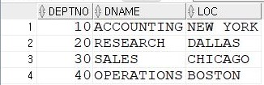

# 연습문제

DEPT 테이블 <br>
 <br> <br>
EMP 테이블 <br>
 <br>

### 1번(1)
```sql
CREATE TABLE EMPIDX AS SELECT * FROM EMP;

SELECT * FROM EMPIDX;
```

### 1번(2)
```sql
CREATE INDEX IDX_EMPIDX_EMPNO ON EMPIDX(EMPNO);
```

### 1번(3)
```sql
SELECT * FROM USER_IND_COLUMNS;
```

### 2번
```sql
CREATE VIEW EMPIDX_OVER15K (EMPNO, ENAME, JOB, DEPTNO, SAL, COMM)
AS (SELECT EMPNO, ENAME, JOB, DEPTNO, SAL, NVL2(COMM, 'O', 'X') AS COMM
    FROM EMP
    WHERE SAL > 1500);

SELECT * FROM USER_VIEWS;
SELECT * FROM EMPIDX_OVER15K;
```

### 3번(1)
```sql
CREATE TABLE DEPTSEQ AS SELECT * FROM DEPT;

SELECT * FROM DEPTSEQ;
```

### 3번(2)
```sql
CREATE SEQUENCE DEPTSEQ_SEQ
                INCREMENT BY 1
                START WITH 1
                MAXVALUE 99
                MINVALUE 1
                NOCACHE;

SELECT * FROM USER_SEQUENCES;
```

### 3번(3)
```sql
INSERT INTO DEPTSEQ (DEPTNO, DNAME, LOC) VALUES (DEPTSEQ_SEQ.NEXTVAL, 'DATABASE', 'SEOUL');
INSERT INTO DEPTSEQ (DEPTNO, DNAME, LOC) VALUES (DEPTSEQ_SEQ.NEXTVAL, 'WEB', 'BUSAN');
INSERT INTO DEPTSEQ (DEPTNO, DNAME, LOC) VALUES (DEPTSEQ_SEQ.NEXTVAL, 'MOBIE', 'ILSAN');

SELECT * FROM DEPTSEQ;
```
