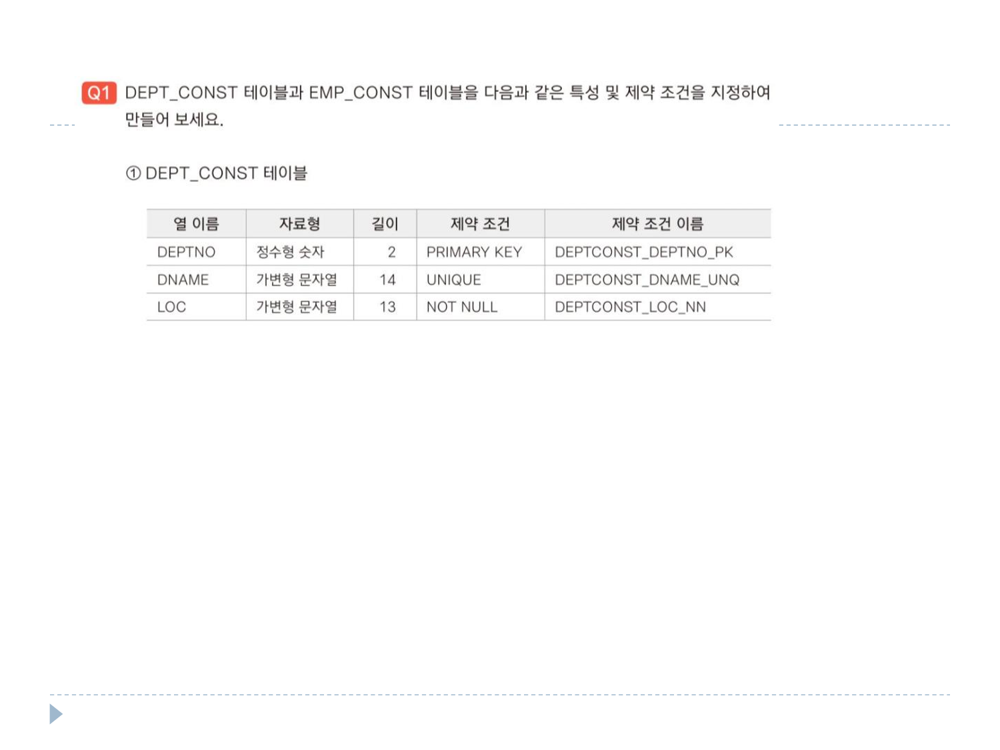
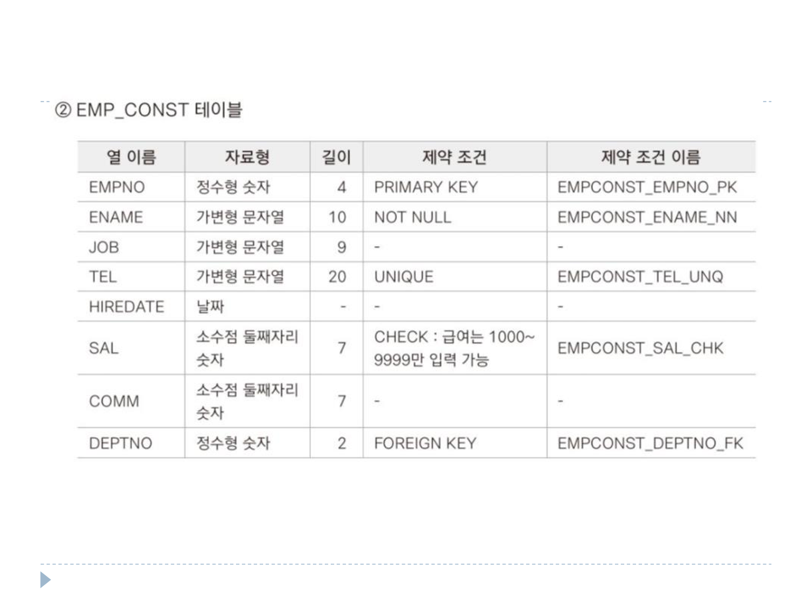
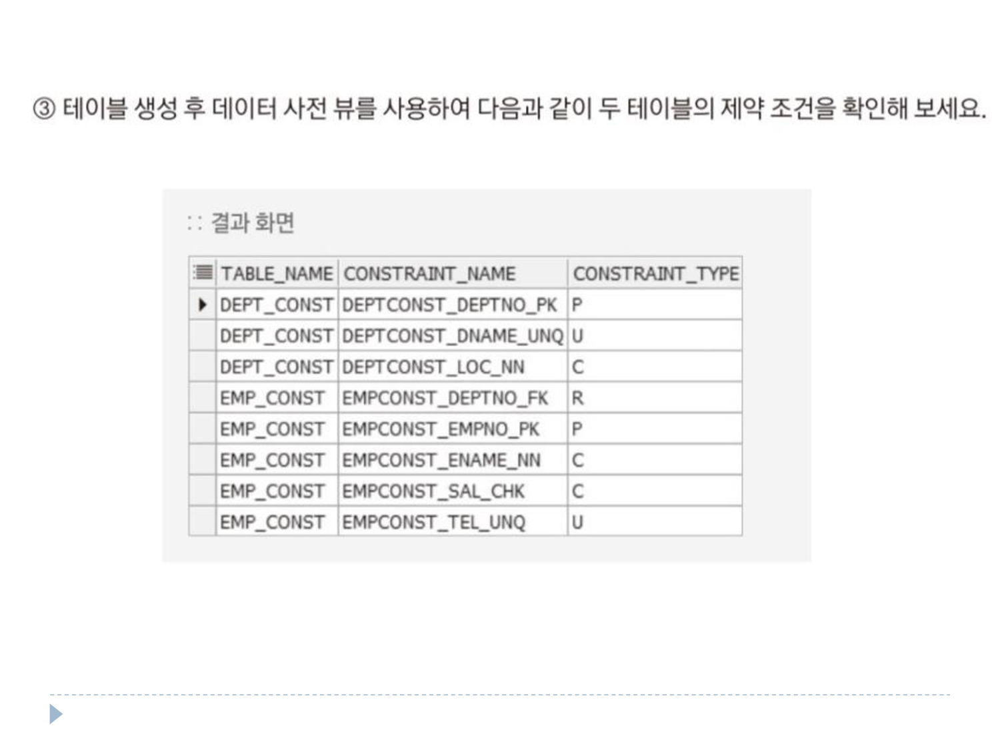

# 연습문제

DEPT 테이블 <br>
 <br> <br>
EMP 테이블 <br>
 <br>

### 1번(1)
```sql
CREATE TABLE DEPT_CONST (
    DEPTNO NUMBER(2) CONSTRAINT DEPTCONST_DEPTNO_PK PRIMARY KEY, 
    DNAME VARCHAR2(14) CONSTRAINT DEPTCONST_DNAME_UNQ UNIQUE,
    LOC VARCHAR2(13) CONSTRAINT DEPTCONST_LOC_NN NOT NULL
);

SELECT * FROM USER_CONSTRAINTS;
```

### 1번(2)
```sql
CREATE TABLE EMP_CONST(
    EMPNO NUMBER(3) CONSTRAINT EMPCONST_EMPNO_PK PRIMARY KEY,
    ENAME VARCHAR2(10) CONSTRAINT EMPCONST_ENAME_NN NOT NULL,
    JOB VARCHAR2(9),
    TEL VARCHAR2(20) CONSTRAINT EMPCONST_TEL_UNQ UNIQUE,
    HIREDATE DATE,
    SAL NUMBER(7,2) CONSTRAINT EMPCONST_SAL_CHK CHECK (SAL > 1000 AND SAL < 9999),
    COMM NUMBER(7,2),
    DEPTNO NUMBER(2) CONSTRAINT EMPCONST_DEPTNO_FK REFERENCES DEPT_CONST (DEPTNO)
);

DESC EMP_CONST;
```

### 1번(3)
```sql
SELECT TABLE_NAME, CONSTRAINT_NAME, CONSTRAINT_TYPE
FROM USER_CONSTRAINTS
WHERE TABLE_NAME IN ('EMP_CONST', 'DEPT_CONST')
ORDER BY CONSTRAINT_NAME;
```
